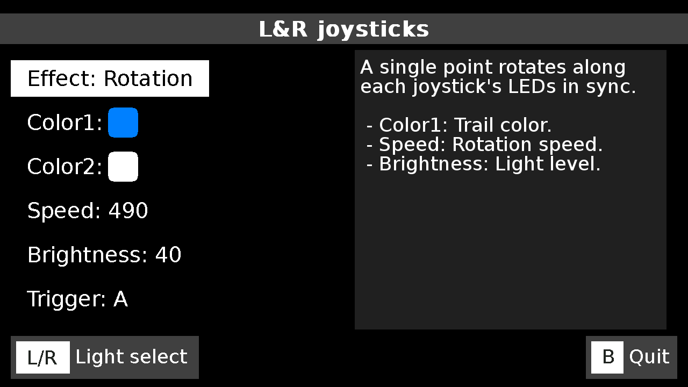
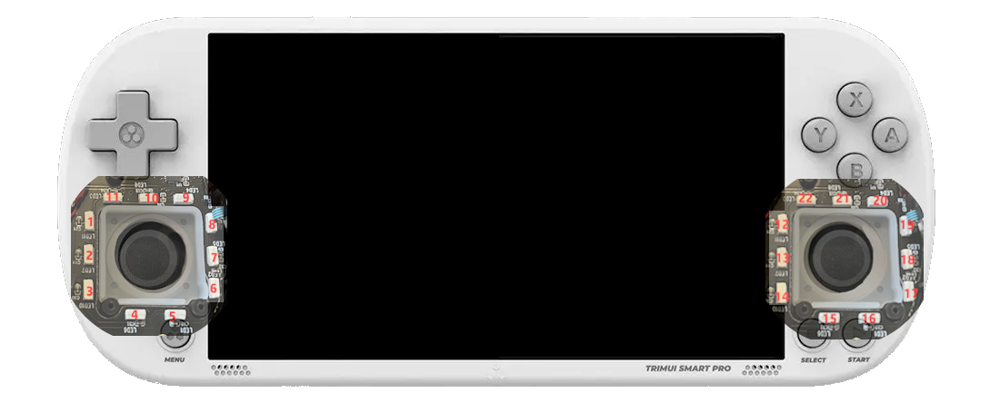

# TrimUI Smart Pro LED Manager (CrossMix Edition)

This is a **LED control daemon for the TrimUI Smart Pro**, designed specifically for use with **CrossMix OS**.

It is based on [LedControl](https://github.com/ro8inmorgan/LedControl) by [ro8inmorgan](https://github.com/ro8inmorgan), **heavily modified and extended** to support:

- The specific LED layout of the TrimUI Smart Pro (TSP)
- Built-in CrossMix LED effects:  
  `Battery Level`, `CPU Temp`, `CPU Speed`, `Ambilight`, etc.
- Brand-new effects:  
  `Rotation`, `Rotation Mirror`, `Directions`, and more.
- An improved UI adapted to the visual style of **CrossMix**
- A **description panel per effect**, explaining how it works and how to configure it

---

## ✨ Features

- Fully compatible with the TSP’s 23-LED layout
- Per-effect configuration via `led_daemon.conf`
- Runtime effect switching
- Joystick-triggered reactive effects
- Shared brightness control (MainUI with optional UI-synced override)
- Smooth animations: rainbow waves, pulses, color flows, and D-pad indicators
- Battery level visualization with blinking alert when charge is low

---

## 📷 Screenshots



---

# Installation

You have nothing to do on CrossMix OS, it's included natively.

For other you can download the archive of this repo and extract it to a new `Apps\LedControl/` folder on your SD card. OS based on MinUI/NextUI will require some adaptation.

Some effects like Ambilight have dependencies from CrossMix (python and a pip package to get the main color)

Then run "Led Control" app.

---


## ⚙️ Configuration (`led_daemon.conf`)

It is recommended to use the provided UI to modify the settings.

L&R buttons to switch between lights
D-pad up/down to select the setting and left/right to adjust its value

B Button to quit the application  


Example configuration file:

```
[m]
effect=12
color=0xFFFFFF
color2=0xFFFFFF
duration=800
maxeffects=17
brightness=40
trigger=2

[lr]
effect=19
color=0x0080FF
color2=0xFFFFFF
duration=490
maxeffects=21
brightness=40
trigger=2
```


- `[m]` → Central LED
- `[lr]` → Joystick rings (left and right)

Each effect supports different parameters like:

- `effect`: number of the current effect between 1 and `maxeffects`
- `color` / `color2`: some effects use 1 color (I.e. Static), some are using 2 colors (i.e. Reactive), some have their own colors and doesn't use these parameters (Fire, Color Drift, Rainbox, Aurora...)
- `duration` This is the duration if the effect: a smaller value will increase the speed of the effect
- `trigger` Only used by "Reactive" effect
- `brightness` 0–100, or `-1` to follow MainUI settings (recommended)
- `maxeffects` The number of effects supported by the current light (do not modify)


Descriptions for each effect are visible in the UI thanks to editable text files located in `effect_desc` folder

---

## 🔋 Example: Battery Level Effect (`effect=16`)

Displays a smooth color gradient based on the battery percentage:

- **Green** → 100%  
- **Yellow** → Medium  
- **Red** → Low battery  
- **Blinking red** when battery <10%

**Behavior adjusts based on:**

- `duration` → Controls the blinking speed  
- `brightness` → Overall intensity  
- Battery level is read every **5 seconds**

---

## 🧠 Notes on TSP LED System

- All LEDs share a **single global brightness value** (`max_scale`)
- Brightness cannot be controlled per light — only globally
- Colors are written as **24-bit RRGGBB** hex (not XRGB or 32-bit)
- Frames are sent to:
  - `/sys/class/led_anim/frame_hex`
  - `/sys/class/led_anim/effect_rgb_hex_<light>`
- The two joystick rings (left and right) indexing:
 



## 🧠 Understanding `frame_hex` vs `effect_rgb_hex_*`

The TrimUI Smart Pro LED system exposes multiple sysfs interfaces under `/sys/class/led_anim/`, and it's important to know **which interface does what** to avoid conflicting effects between different LED zones.

`cat /sys/class/led_anim/help` displays some description about the TrimUI LED Animation driver

---

### 🔷 `frame_hex`

```
/sys/class/led_anim/frame_hex
```

#### ✅ What it does:
- Manually sets **all 23 LEDs at once**, using full RRGGBB colors.
- You must supply 23 space-separated hex color values (one for each LED, with a space at the end !).
- Example:

```
echo "FF0000 00FF00 0000FF ... [23 total] " > /sys/class/led_anim/frame_hex
```

#### ⚠️ Important:
- It is **not scoped per-light**:it **overwrites the entire LED state**, including both left and right rings and the center light.

---

### 🔶 `effect_rgb_hex_m` and `effect_rgb_hex_lr`

```
/sys/class/led_anim/effect_rgb_hex_m  
/sys/class/led_anim/effect_rgb_hex_lr
```

#### ✅ What they do:
- Provide a **single RRGGBB color** to a **hardware-animated effect** (fade, pulse, etc.).
- Only affect their specific light zone: either `"m"` or `"lr"`.
- Are used in combination with:

```
echo 1  > /sys/class/led_anim/effect_lr  
echo 10 > /sys/class/led_anim/effect_duration_lr
echo 1  > /sys/class/led_anim/effect_cycles_lr
```

#### ✅ Advantage:
- These files are **light-scoped**, meaning there's no interference between `m` and `lr`.
- Once the effect is launched, it is entierly managed by the driver itself.

---

### 🧠 Summary Table

| Interface                | Scope     | Purpose                      |
|--------------------------|-----------|-------------------------------|
| `frame_hex`              | Global    | Full LED array override       |
| `effect_rgb_hex_lr/m`    | Per-light | Pass color to hardware effect |

---

### ✅ Best Practices

- Use `frame_hex` **only** for a single global effect at a time.
- Avoid using `frame_hex` and `effect_rgb_hex_*` simultaneously.
- Prefer `effect_rgb_hex_*` for simple effects with only one color per light, complex effects like rainbox will use `frame_hex`.

---

## ⚙️ Configuration (`led_daemon.conf`)

It is recommended to use the provided UI to modify the settings.

L&R buttons to switch between lights
D-pad up/down to select the setting and left/right to adjust its value

B Button to quit the application  


Example configuration file:

```
[m]
effect=12
color=0xFFFFFF
color2=0xFFFFFF
duration=800
maxeffects=17
brightness=40
trigger=2

[lr]
effect=19
color=0x0080FF
color2=0xFFFFFF
duration=490
maxeffects=21
brightness=40
trigger=2
```


- `[m]` → Central LED
- `[lr]` → Joystick rings (left and right)

Each effect supports different parameters like:

- `effect`: number of the current effect between 1 and `maxeffects`
- `color` / `color2`: some effects use 1 color (I.e. Static), some are using 2 colors (i.e. Reactive), some have their own colors and doesn't use these parameters (Fire, Color Drift, Rainbox, Aurora...)
- `duration` This is the duration if the effect: a smaller value will increase the speed of the effect
- `trigger` Only used by "Reactive" effect
- `brightness` 0–100, or `-1` to follow MainUI settings (recommended)
- `maxeffects` The number of effects supported by the current light (do not modify)


Descriptions for each effect are visible in the UI thanks to editable text files located in `effect_desc` folder

---

## 🔋 Example: Battery Level Effect (`effect=16`)

Displays a smooth color gradient based on the battery percentage:

- **Green** → 100%  
- **Yellow** → Medium  
- **Red** → Low battery  
- **Blinking red** when battery <10%

**Behavior adjusts based on:**

- `duration` → Controls the blinking speed  
- `brightness` → Overall intensity  
- Battery level is read every **5 seconds**

---

## 📁 Source

Based on [LedControl](https://github.com/ro8inmorgan/LedControl)  
Adapted and expanded by the Cizia for TrimUI Smart Pro and [CrossMix OS](https://github.com/cizia64/CrossMix-OS/)
